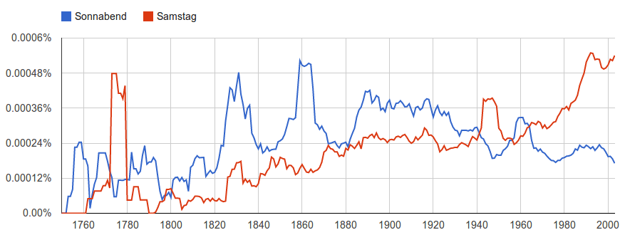

## Deutsch im Wandel

### Daniel Fried

## Wichtigen Perioden
- 750-1050: Althochdeutsch
- 1050-1350: Mittelhochdeutsch
- 1350-1650: Früneuhochdeutsch
- 1650- : Neuhochdeutsch

## 750-1050: Althochdeutsch

Herrengebet: 

*Fater unseer, thu pist in himile, uuihi namun dinan*, 8. Jahrhundert

*Vater unser im Himmel, geheiligt werde dein Name*, jetzt

## 1050-1350: Mittelhochdeutsch

Das Niebelungenlied:

*Uns ist in alten mæren wunders vil geseit*, 13. Jahrhundert

*Uns wird in alten Erzählungen viel Wunderbares berichtet* - jetzt

## 1350-1650: Früneuhochdeutsch

*Im anfang war das Wort, vnd das wort war bey Gott, vnd Gott war das Wort.*, Luther, 1545

*Im Anfang war das Wort, und das Wort war bei Gott, und Gott war das Wort.* - jetzt (Neuhochdeutsch)

## Über die Umlaut

## Beispiele

## *Deutsch*

*Teutons* ("von der Volke", altsächsisch) -> *tiutsch* -> *diutsch* -> *deutsch*

## *Samstag, Sonnabend*

- *שבת* (hebräisch) -> *sabbaton* (griechisch) -> *sabbatum* (lateinisch) -> *samztac* (althochdeutsch) -> *Samstag*

- *sun-ábent* ("Tag zuvor Sonntag", mittelhochdeutsch) -> Sonnabend

## *zwischen*

*zwëne* (althochdeutsch, "zwei") -> *zwisk* ("ein Paar") -> *in zwiskén* ("zwischen ein Paar") -> *inzwischen* ->  *zwischen*

## *begreifen*

*grifan* (althochdeutsch, "mit den Händen nehmen") -> *bigrifan* (mittelhochdeutsch, "mit dem Kopf nehmen") -> *begreifen* ("verstehen")

*grifan* -> *gripe* (altenglisch) -> *grip* (englisch)

## *Beispiel*

*spël* (mittelhochdeutsch, "Fabel", "Geschichte") -> *bispel* (früneuhochdeutsch, "Fabel", "Sprichwort")  -> *Beispiel*

*spël* -> *spell* (englisch)  -> *gospel*

## *Gift*

*gift* (althochdeutsch, "das Geschenk") -> "etwas geben" -> "ein Getränk geben" -> "Medizin geben" -> "Toxin geben" -> "Toxin"

auf andere Sprachen auch:

पिबति (sanskritisch, "trinken") -> *potion* (lateinisch, "ein Getränk") -> *poison* (französisch, "Toxin")

## *Beamer*

ein Neologismus, seit 2013 im Wörterbuch (Duden)

*beam* (englisch) -> *Beamer* ("Videoprojektor")

